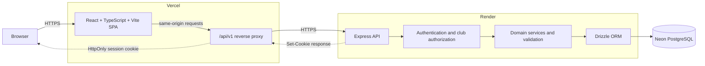

# CampusFlow

**Live Demo:** [https://campusflow-brown-zeta.vercel.app](https://campusflow-brown-zeta.vercel.app)

CampusFlow is a full-stack workspace for running campus clubs across membership, team structure, event operations, and recruitment. It gives each club a focused, role-aware workspace while allowing one student account to participate in multiple clubs with different responsibilities.

CampusFlow is a production-deployed full-stack application with a responsive React interface backed by an Express API, PostgreSQL data model, and server-side session authentication. Its core workflows are deployed across Vercel, Render, and Neon and have been manually verified in production.

## The problem

Campus clubs often coordinate members, team ownership, event staffing, attendance, and recruitment across unrelated spreadsheets, forms, and chat threads. That fragmentation makes permissions unclear, loses historical context, and turns routine operations into manual reconciliation.

CampusFlow brings those workflows into one club-scoped system. Roles and records stay attached to the correct club, operational history is preserved, and applicants and organizers use the same application without collapsing distinct responsibilities into a single global role.

## Key features

- Multi-club accounts with a dedicated workspace for each campus organization
- Club-scoped `ADMIN`, `LEAD`, and `MEMBER` roles
- Member administration by email, including role and membership-status management
- Configurable club teams with one current primary team per active member
- Time-bounded primary-team history instead of destructive reassignment
- Multiple active leads per team, with one person able to lead multiple teams
- Event creation by admins and leads, with administrator approval for lead-created events
- Event coordinator and volunteer assignments with optional working-team context
- Member acceptance or decline of personal event assignments
- Manual `PRESENT` / `ABSENT` attendance tracking for approved events
- Recruitment drives with controlled draft, open, closed, and cancelled states
- Applicant submissions with ordered, unique team preferences
- Applicant viewing and editing while the recruitment window remains open
- Administrator review with under-review, shortlisted, selected, and rejected outcomes
- Multi-tenant club isolation across memberships, teams, events, assignments, and recruitment
- Database-backed server sessions delivered through secure, HttpOnly cookies

## Architecture



The Vercel frontend sends credentialed requests to its own `/api/v1` path. Vercel rewrites those requests to the Render API, keeping the browser-facing traffic same-origin. The API validates the session and club context before domain services access Neon through Drizzle.

## Tech stack

| Layer | Technology |
| --- | --- |
| Frontend | React, TypeScript, Vite |
| Routing and data | React Router, TanStack Query |
| Forms and UI | React Hook Form, Lucide React, custom responsive CSS |
| Backend | Node.js, Express, TypeScript |
| Validation | Zod |
| Authentication | Server-side sessions, secure cookies, bcrypt password hashing |
| Database | PostgreSQL on Neon |
| ORM and migrations | Drizzle ORM, Drizzle Kit |
| Hosting | Vercel frontend, Render API, Neon PostgreSQL |

## Authentication and security design

- Passwords are hashed with bcrypt before storage.
- Login and registration create a cryptographically random session token. Only its SHA-256 hash is stored in PostgreSQL.
- The raw token is sent in the `campusflow_session` cookie with a seven-day lifetime.
- The cookie is `HttpOnly`, uses `Path=/`, is `Secure` with `SameSite=None` in production, uses `SameSite=Lax` locally, and uses matching attributes when logout clears it.
- Production CORS accepts one exact `CLIENT_ORIGIN` and enables credentials; production write requests also pass an origin check.
- Protected API routes resolve the current active user from the server-side session before continuing.
- Club middleware resolves an active membership and enforces route-specific roles. Frontend role-aware controls are only a usability layer; the API remains authoritative.
- Request DTOs are validated with Zod, and unexpected server errors return a generic response rather than stack details.
- Actual environment files and build output are excluded from Git.

## Important business rules

- A user can hold memberships in multiple clubs, and their role belongs to the membership—not to the user globally.
- A club must retain at least one active administrator.
- An active team lead must remain an active club member with either the `LEAD` or `ADMIN` role.
- Assigning a `MEMBER` as a team lead promotes that membership to `LEAD`; administrators remain administrators.
- A member has at most one active primary-team assignment. Reassignment closes the previous record so history remains available.
- Team leadership is many-to-many: teams may have several leads, and leads may manage several teams.
- Admin-created events are approved immediately. Lead-created events enter `PENDING_APPROVAL` and require an admin.
- Event assignments and attendance are limited to approved events and active club memberships.
- Members can accept or decline only their own event assignments.
- Recruitment drives follow forward-only workflow transitions and must respect their configured opening and closing times.
- Each user can submit one application per drive. Preferences must refer to active teams in that club and use unique teams and ranks.
- Applicants can edit their own application only while the drive is open and within its time window.
- Selecting an applicant records a review outcome; it does not automatically create a club membership.

## Domain model

| Relationship | Meaning |
| --- | --- |
| `Campus` 1 → many `Club` | A campus groups independently operated clubs. |
| `User` many ↔ many `Club` through `ClubMembership` | The membership stores the user's club-specific role, status, and join date. |
| `Club` 1 → many `Team` | Teams are configured inside one club and cannot be reused across club boundaries. |
| `ClubMembership` 1 → many historical `TeamMembership` records | A partial uniqueness rule permits only one current primary team while retaining earlier assignments. |
| `Team` many ↔ many `ClubMembership` through `TeamLeadAssignment` | Leadership assignments are time-bounded and support shared or cross-team leadership. |
| `Club` 1 → many `Event` | Events record their creator, approval state, schedule, venue, and visibility metadata. |
| `Event` 1 → many `EventAssignment` | Each assigned club member is a coordinator or volunteer with a response status and optional working team. |
| `Event` 1 → many `EventAttendance` | One attendance record per member and event stores the manual status and the membership that marked it. |
| `Club` 1 → many `RecruitmentDrive` | A drive owns a dated application window and lifecycle state. |
| `RecruitmentDrive` 1 → many `Application` | A user may submit at most one application to a drive. |
| `Application` 1 → many `ApplicationPreference` → `Team` | Preferences connect an application to active club teams using an ordered rank. |

Club IDs are carried through domain records and composite foreign keys where appropriate. Services also scope reads and mutations by club, preventing an identifier from another club from being used to cross workspace boundaries.

## Repository structure

```text
CampusFlow/
├── client/
│   ├── public/                 # Static frontend assets
│   ├── src/
│   │   ├── api/                # Typed API client and query keys
│   │   ├── app/                # Router and query-client setup
│   │   ├── auth/               # Auth queries and route guards
│   │   ├── components/         # Club, member, team, event, and recruitment UI
│   │   ├── layouts/            # Auth, application, and club layouts
│   │   ├── pages/              # Route-level screens
│   │   ├── styles/             # Shared responsive styling
│   │   └── utils/              # Date and recruitment helpers
│   ├── vercel.json             # API proxy and SPA fallback rewrites
│   └── package.json
├── server/
│   ├── drizzle/                # Versioned SQL migrations and metadata
│   ├── src/
│   │   ├── config/             # Validated runtime environment
│   │   ├── db/                 # Connection, schema, and local seed utility
│   │   ├── middleware/         # Authentication, authorization, and errors
│   │   └── modules/            # Auth, clubs, teams, events, and recruitment
│   ├── drizzle.config.ts
│   └── package.json
└── README.md
```

## Local development

### Prerequisites

- Node.js `^20.19.0` or `>=22.12.0`
- npm
- A PostgreSQL database reachable through a connection string

### 1. Install dependencies

```bash
cd server
npm ci

cd ../client
npm ci
```

### 2. Configure the environment

Create local files from the provided examples:

```bash
cp server/.env.example server/.env
cp client/.env.example client/.env
```

Replace the placeholder database connection in `server/.env`. The checked-in example values are documentation only; never commit a real `.env` file.

### 3. Apply migrations

```bash
cd server
npm run db:migrate
```

Drizzle reads `DATABASE_URL` from `server/.env`. Confirm the target database before running the command. Migration files are already versioned under `server/drizzle`; use `npm run db:generate` only when intentionally authoring a schema change.

The repository also contains a development-only seed utility for the original demo workspace. It expects an existing `test@campusflow.dev` account and must not be run against production.

### 4. Start the API

```bash
cd server
npm run dev
```

The development API listens on `http://localhost:3000` by default. Health checks are available at:

- `GET /api/v1/health`
- `GET /api/v1/health/db`

### 5. Start the frontend

In another terminal:

```bash
cd client
npm run dev
```

Vite serves the application at `http://localhost:5173`. The client example points directly to the local API at `http://localhost:3000/api/v1`.

## Environment variables

### Server

| Variable | Required | Purpose |
| --- | --- | --- |
| `DATABASE_URL` | Yes | PostgreSQL connection string used by the API and Drizzle Kit. |
| `CLIENT_ORIGIN` | Production; local default available | Exact browser origin allowed by CORS and production write-request checks. Production requires HTTPS and no trailing slash. |
| `NODE_ENV` | No; defaults to `development` | Accepts `development`, `test`, or `production` and controls production cookie behavior. |
| `PORT` | No; defaults to `3000` | HTTP port. Render supplies this in production. |

See [`server/.env.example`](server/.env.example).

### Client

| Variable | Required | Purpose |
| --- | --- | --- |
| `VITE_API_BASE_URL` | Recommended | API prefix compiled into the Vite bundle. Use the local API URL in development and `/api/v1` on Vercel. |

See [`client/.env.example`](client/.env.example). Vite variables are browser-visible and must never contain secrets.

## Production deployment

```text
Browser
  → Vercel React frontend
  → Vercel /api/v1 reverse proxy
  → Render Express backend
  → Neon PostgreSQL
```

### Vercel

- Framework preset: `Vite`
- Root directory: `client`
- Install command: `npm ci`
- Build command: `npm run build`
- Output directory: `dist`
- Production environment: `VITE_API_BASE_URL=/api/v1`
- `client/vercel.json` sends API requests to Render before applying the React Router SPA fallback.

### Render

- Root directory: `server`
- Build command: `npm ci && npm run build`
- Start command: `npm start`
- Health-check path: `/api/v1/health`
- Required production variables: `DATABASE_URL`, `CLIENT_ORIGIN`, `NODE_ENV=production`, and Render's `PORT`
- `CLIENT_ORIGIN` must exactly match the stable HTTPS Vercel frontend origin.

### Neon

- Supply the Neon PostgreSQL connection string through Render's `DATABASE_URL` environment variable.
- Keep SSL parameters provided by Neon in the connection string.
- Apply committed migrations deliberately from a trusted environment; do not run the development seed against production.

## Testing and verification

The repository exposes the following repeatable quality checks:

```bash
cd client
npm run lint
npm run build

cd ../server
npm run typecheck
npm run build
```

The production deployment has also been manually verified across the core production workflows:

- API and database health checks against Render and Neon
- Registration, login, current-user session restoration, and logout
- Multi-club navigation and club-scoped role-aware interfaces
- Member role/status management, primary-team reassignment, and team history
- Multiple leads on one team and one lead across multiple teams
- Event creation, approval, coordinator/volunteer assignment, personal responses, and attendance
- Recruitment-drive lifecycle controls, ranked-preference submission, applicant editing, and admin review statuses
- Vercel API proxy behavior and direct refreshes of nested React Router routes
- Responsive use of the primary frontend workflows

There is currently no automated unit, integration, or end-to-end test suite; validation for this milestone combines static checks, production builds, and manual workflow testing.

## Current scope and future improvements

- Campus and club provisioning are not self-service UI workflows; the current application operates on existing club data.
- Selecting a recruitment applicant does not automatically create a membership or team assignment.
- Attendance is intentionally manual, with no QR-code or check-in automation.
- Email invitations, notifications, and reminders are outside the current release.
- Expanded edit/archive lifecycle controls, automated tests, CI, observability, and accessibility audits would be natural next steps.

## Project status

**Production MVP deployed**. Core membership, team, event, and recruitment workflows are implemented and manually verified in production. Future iterations can extend the platform with automated testing, notifications, richer lifecycle controls, and additional campus-level administration.
